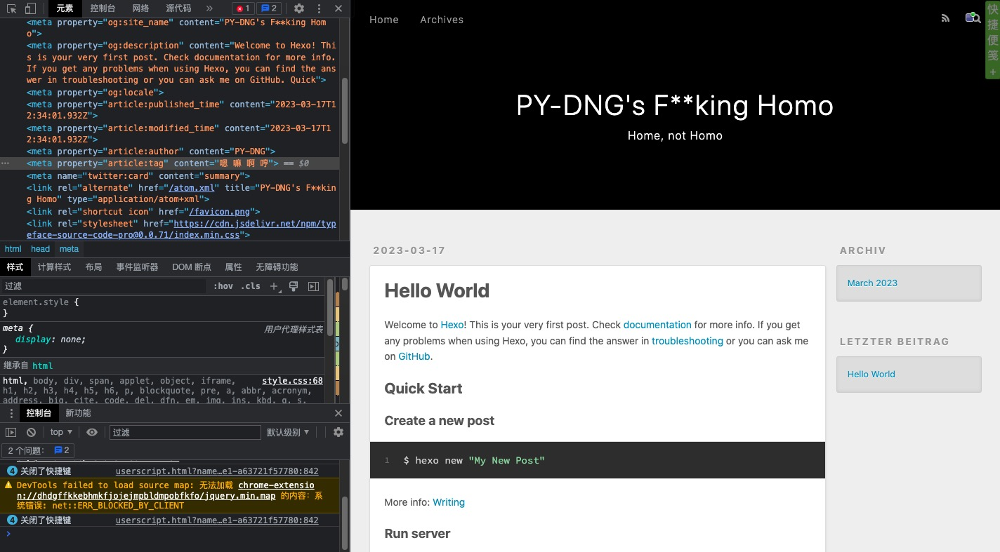
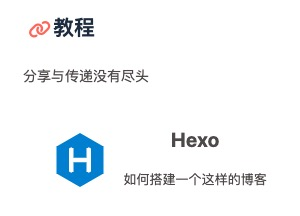

# Hexo博客纪要

## 一、博客搭建 （2023-03-18）

Hexo官网：[Hexo](https://hexo.io/zh-cn/)

总之就是按照官网一步步开始，要求有一点点git基础，认识github，知道怎么初始化一个git仓库，怎么push到github上面去，怎么用github pages发布自己的静态网站

这时候我搭建出来的最初版网站长这个样子：

从初中开始就眼馋各位大佬<del>先辈</del>前辈的个人博客，现在终于开始着手自己做一个了，想想还是挺激动的。

对了，这个教程是从这里找到的：

[下北泽野兽株式会社](https://xianbei114514.com/) ==> [homo商城](https://114514.store/) ==> [友情链接](https://114514.store/partnersites.html) ==> [ChuJiani's Blog](https://blog.chujiani.top/) ==> [友链](https://blog.chujiani.top/link/) ==> Hexo

感谢。分享和传递没有尽头。
