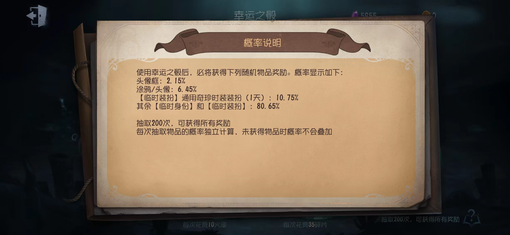
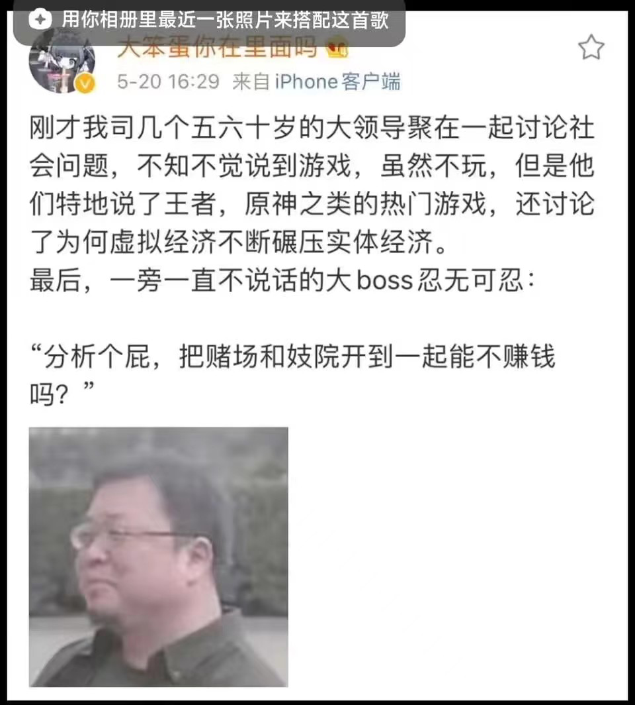

# #1 抽奖

刚刚打第五人格突发奇想抽一抽奖，看了看概率是这样的：

奖品内容都是头像框涂鸦什么的，也没啥吸引我的，反而是角色体验卡和蓝皮体验卡比较有用，再加上碎片我也不需要留着买皮肤，就随缘试试概率准不准，封顶10次，10次内抽到除蓝皮体验卡和角色体验卡以外的物品直接停止。

粗略分类，临时身份和临时装扮（蓝皮体验卡）获得概率为80.65%，那么小学数学可得


80.65\%^{3} \approx 0.525 \\
80.65\%^{5} \approx 0.341 \\
80.65\%^{6} \approx 0.275 \\
80.65\%^{7} \approx 0.222 \\
80.65\%^{8} \approx 0.179 \\
80.65\%^{9} \approx 0.144 \\
80.65\%^{10} \approx 0.116


而我抽奖的结果是10次都是蓝皮体验卡或角色体验卡，等于说我中了那11.6%的概率，连抽10次没有出货。当然，这也并不能说明抽奖机制有问题，毕竟我这只是个例，样本太小，没有重复实验，但对我来说，得出游戏抽奖不适合我的结论已经足够了。



# #2 猜想

其实我一直对于游戏抽奖有一点“偏见”式的猜想：概率是被操纵的。之所以叫做“偏见”，因为我没有证据，也未曾调查过，但这并不妨碍我抱持这样一种看法。

曾经在那个游戏运营无需公布抽奖概率的时代，我觉得不用说明也无需证明，游戏运营方操纵抽奖的事是百分百发生的，只要想想这里面巨大的利润，我想就不会有游戏公司拒绝这么做。当然，按照现在的法律要求，游戏抽奖的概率都是要公开的，并且必须要有保底机制。然而，公开的抽奖概率和保底机制，是否就保证了公平呢？游戏公司在这里面有没有操作空间呢？我认为是有的。



操纵抽奖的方式有很多种。

首先最容易想到的，就是操作抽奖概率。明面上写的是10%概率中金皮，实际上是8%，假设一次抽奖折合现实货币需要1元，本来抽10次出一张金皮（10元/张），变成了平均12.5次出一张（12.5元/张），利润提升为原来的125%。这种操作抽奖的方法，最怕的就是公布概率，也是最经不起检验的。一旦有人取样核算一下，马上就会露馅，我暂且认为这种操纵手法没有被使用。

其次还容易想到的，就是直接操作抽奖的结果。在保持总体抽奖中率不变的情况下，操纵出金的时机或者账号。比如，全服共抽奖1,000,000次，标明出金概率10%，那么应当有100,000次抽中金皮，实际上也确实出了100,000张金皮，但是我让同一个账号出两次这张金皮，同时另一个账号不出，诶，你也想要这张金皮对吧，残念，你还得继续充，这利润不就来了么。或者，根据你账号里面剩余的抽奖次数，操纵出金的时机。比如10%的出货概率，你账号里还剩20抽，理论上应该每10次出一次对吧，这次出了还能留10次抽下一个池子，但我操纵你出货的时机，抽到第18发和第19发连续出货两次，而不是第10次左右出，第20次左右再出，这样除非你一次一次抽，不然大概率就被坑了，20抽一个池子出两个同样的货，相当于浪费10抽。下一个池子也想要？给我继续充！这两种操纵抽奖的方式都是不易被查风险极小的，而且可以轻易用程序代码实现，简单稳定高效地提升经营抽奖的利润。

但上面这种依然属于数学范畴的抽奖操纵手法，真正要提升利润还要看经济学的抽奖操纵，而经济学范畴的抽奖操纵的花活儿可就多咯。最简单也最经典的一种就是测算每个账号的需求曲线，根据你需求曲线弹性决定你出不出货。原理很简单，做法也很简单，就是统计每个账号历史抽奖的记录，抽奖越多，为了抽奖充值越多，就判断你抽奖需求曲线弹性越小，就狠狠地降低你账号的出货概率，而相应地，提升那些不怎么喜欢抽奖，或者抽完免费次数就不愿意继续充值抽的账号的中率。这样，就可以在保持总体抽奖概率不跑偏的同时恰更多的米，必须狠狠地压榨有充值能力的劳苦人民（笑）！当然，这只是最简单也是最基础的割韭菜的方法，实际上还可以建立更加复杂的模型，引入更多变量，对操纵出货的时机、账号、概率等更多因素进行控制，提升整体利润。



> “在保持总体抽奖概率不跑偏的同时恰更多的米”，那既然总体抽奖概率不跑偏，不管怎么操纵，利润率不变啊！怎么恰到更多的米呢？
> 
> 首先，是利润率不变而不是利润不变。通过如此操作，可以让愿意充值的玩家多充值抽奖，而与此同时不怎么需要抽奖出货的玩家即使提前出货也不会影响，从他们身上赚的利润多少，因为这些玩家无论他们出不出货，都大概率不会为了抽奖而充值，我们可以让这些玩家多出几次货，反正给他们出货对于我们来说是没有成本的。如此一来，就相当于愿意充值抽奖的玩家在为不愿意充值抽奖的玩家买单，掏自己的腰包帮这些不抽奖的玩家出了货。利润率确实没变，但是成交数量增多了，利润自然也就多了。
> 
> 上面这种解释，是符合常理、符合数学规律、符合逻辑的，我想大多数专门展开来看的人都是对于逻辑有一定追求的人，这种解释你们应该可以满意。但是，下面还有一点不符合逻辑的、你可以称之为“诡辩”的解释，我不求这种观点受到认可，但我觉得确实存在着这么一种可能。那就是，我认为利润率也不一定是不变的，而这是因为我认为“总体抽奖概率不跑偏”中的“总体抽奖概率”这个概念有一定的解释空间。
> 
> 所谓“总体抽奖概率”，一般来说是指“全部出货次数占所有实际发生的抽奖次数的比例的期望”。但是，作为游戏公司，也可以将其解释为“全部可出货次数占所有可抽奖次数的比例的期望”。什么意思呢，就是说按照“如果所有玩家都使用了他们全部的抽奖次数后能出货的次数”和“所有玩家拥有的抽奖次数”计算出货概率。如果所有玩家都把抽奖次数都用了，那么实际出货率就是我公布的概率，然而有些玩家没有用完，导致有一些本应出货的抽奖没有发生，而这些没有发生的抽奖中，出货占比高于公布的概率，那么实际发生的抽奖里出货占比低于公布的概率这件事，也就不是无法解释了。也就是说，游戏公司还可能通过这种“耍赖”的方式，也就是另一种操纵出货时间的手法，提升抽奖的利润率，通过这种解释话术明目张胆地“更改”出货概率。
> 
> 当然，后面这种观点我也只能想想，在折叠区域里小声地bb两句，毕竟不太现实。秉着记录随想的原则，我想到了也就写下来了，在这里没有太多严肃的束缚。



# #3 结论

光有猜想没有实践验证说啥结论，毛主席说过，“没有调查，没有发言权”！但是就我个人来讲是比较讨厌手游抽奖这种运营模式的，有种被收智商税的感觉，哪怕我不怎么抽奖也从来没充值过，只要充值抽奖机制存在，就是明目张胆地在侮辱我的智商。

当然，这是作为玩家的感想，如果是从经营的角度来看，我是很赞赏这种盈利模式的，它让本不容易赚钱[^1]的手游市场赚得盆满钵满[^2]，我想对于经济发展是很大的贡献，也维持了不少人的生计。

即便如此，我也希望对于手游市场能够有更多的规范，尤其是加强对于游戏抽奖机制的监管和限制。抽奖，是一种经营者最大化发挥把信息不对称优势的经营模式，而这对于玩家来说是不公平的，这直接关系到玩家也就是消费者的权益问题。

[^1]: 游戏收费无非三种，买断/免费体验+付费解锁完整版/免费玩+内购充值或看广告。手游，目前来看愿意买断的玩家并不多；付费解锁完整版的模式实际上和买断是相似的，也没有很多愿意付费的玩家；内购充值在没有抽奖机制的加持下利润率无法和抽奖机制下的利润率相比

[^2]: [手游 利润额排名_百度搜索](https://www.baidu.com/s?ie=utf-8&wd=%E6%89%8B%E6%B8%B8+%E5%88%A9%E6%B6%A6%E9%A2%9D%E6%8E%92%E5%90%8D)
