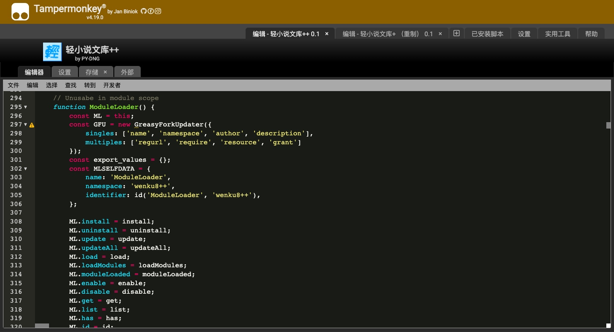
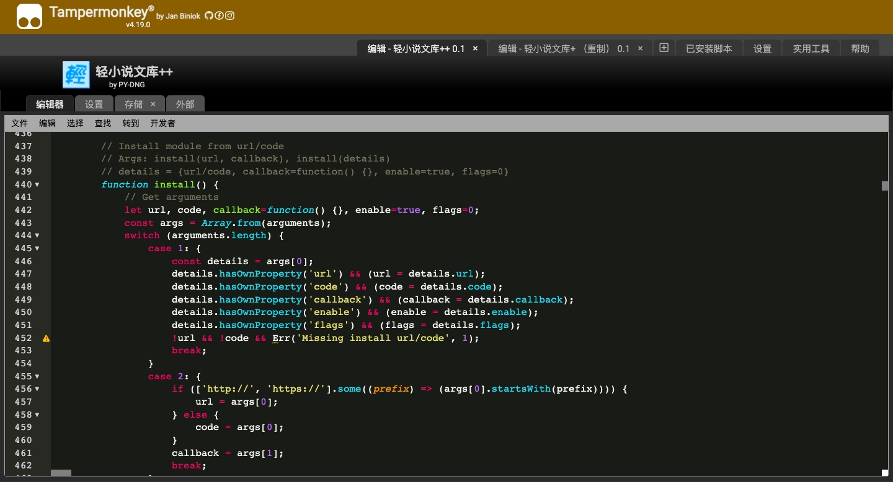

不出意外的话，这一篇应该是会同步在你的日记里吧。

---

[我一直以来在维护的脚本](https://greasyfork.org/scripts/416310)在半年多以前迎来了当时的我所认为的最终的更新。那时我的脚本收到的反馈越来越少，我自己也认为功能日趋完善，很少能发现有效的新需求[^1]。于是脚本的更新就越来越缓慢、越来越少，以至于在半年多以前的那次更新后，很长一段时间内我都没有再发过更新。一段时间以后，逐渐又找到了一些需求，但是当我再次打开代码编辑器时，看到的，是一座从两年前开始不断堆积的屎山。两年前刚刚开始写这个脚本时，我还只是一个刚刚接触网页的小白，对于前端三件套其实都几乎是什么都不懂的。那时候的我，只是因为看到了一个很容易实现有很有用的需求、而且还没有人写过（正好符合我对有效需求的定义，对吧？），就用了两个小时写了一份[极其简单的代码](https://greasyfork.org/scripts/416310/code?version=870399)，传到了greasyfork上面。没记错的话，当时最开始是准备写给自己用的，所以代码还要更加简陋，后来为了传到greasyfork上，让代码至少没有明显的bug，还简单写了写判断不同页面、执行不同功能的框架。我也想不到，这个简陋的框架，就伴随着这个脚本，一路走过了两年的时间。

现在我再看这个框架，不仅简陋、不够优雅，而且完全不能胜任稍微复杂一点的程序任务。但是这个框架的代码对于当时的我来说，也是费了一番心思设计并实现的。后来随着功能越加越多，我在这个小框架上修修补补，就像在一个硬纸壳搭的地基上建起一座高塔一样，在这个简陋的框架上逐渐写出了一个功能繁多的脚本。但是，纸壳做的地基终究是承载不了摩天大楼，终于我在半年多前再看代码时我是忍不了了，下定决心要把代码彻底重新写一遍。当时我对js更加熟悉了一些，也接触了一些javascript代码的模块化组织形式，稍微用过一点Node.js，又在逆向中接触过webpack，更主要地，是接触了the1812大佬的[Bilibili-Evolved](https://github.com/the1812/Bilibili-Evolved)这样一个基于模块加载器框架的功能丰富且强大的脚本，于是就有了自己也来设计一个模块加载器框架来组织代码的想法。

当时我最早的想法，是像Bilibili-Evolved一样，借助github存储和加载具体模块，自己脚本里的代码只需要实现一个网络模块加载器就可以了。这样，不仅代码结构明确、可以实现功能热更新、有利于减小脚本的体积，而且还有机会借助社区的力量，让有想法贡献代码的朋友们直接上传自己写好的模块到github，大家就都可以用到。但是，随着我代码写到一半，我就逐渐认识到了我能力的不足。

按照我的“社区构想”，任何人都可以写模块上传到github，然后让用户通过我的脚本加载运行，那么安全问题就成了一个需要重点关注和解决的现实问题了。一直以来，我的脚本都是自己编写、开源发布在greasyfork上的，不仅我自己信任，而且通过greasyfork的脚本规则和审查、举报机制约束，其他用户也大体可以信任。而现在我要做的，是一个可以加载执行任何未知来源代码的网络模块加载器，那如果加载的模块里有恶意代码怎么办？当然，我不需要也不可能去审核每一个发布到github的模块，我也没有能力和精力去向greasyfork那样维护一个审查机制，从而保障模块代码的纯洁性。理论上，我只要把网络模块加载器的加载和权限隔离机制写好了，保证模块始终可以通过网络模块加载器卸载、停用，或者剥夺某项特殊权限，整体来说恶意代码的威胁性就是可控的。但是，实际写起来，达到这样的要求有何其艰难。事实上，网络模块加载器是运行于tampermonkey上的，而模块则是通过eval或者Function执行，两者之间的权限差异并不大，想要确保网络模块加载器可以时刻管理模块，而模块无法从网络模块加载器中逃逸，我最终没能写出一个满意的答卷，而这个基于网络模块加载器的脚本重置项目也就搁浅了。

但是，脚本重写的工作不能搁浅。于是我思来想去，最终决定用网络模块加载器方案的改版——本地模块加载器，作为脚本的大框架。顾名思义，本地模块加载器，就是把模块代码内置到脚本里，然后再实现模块加载执行的功能，脚本运行时直接加载执行内置的模块。虽然这样丧失了社区共同贡献代码的优势，但是也直接避免了安全问题。所有的代码都是我自己写，来源保持绝对可信，并且还同时满足greasyfork对脚本所加载的外部代码的要求，可以继续发布在greasyfork上。从这里开始，我借鉴着之前写网络模块加载器的已有代码和经验，逐步完善了一个可以加载模块、可以管理模块、适应tampermonkey环境的本地模块加载器。随着测试模块运行成功，我开始逐步编写一个个实现脚本具体功能的模块，开始一步步复原和改善旧版脚本的功能，并适当新增旧版所没有的功能，很多已有的功能也并没有复制旧代码，而是按照现在的编程习惯和知识完全重写，可以说是一遍重写旧代码，一边写新功能。这其中最费事的就是有关GUI的制作。本身就是用户脚本环境，只能使用javascript操作dom树的方式编写html和css，再加上对于html和css（主要是css）的不熟悉，编写和调试就更加困难了。

[^1]: 我认为有效的需求应该具备这些特点：有意义、不重复、可实现、没有超出计划支持范围
