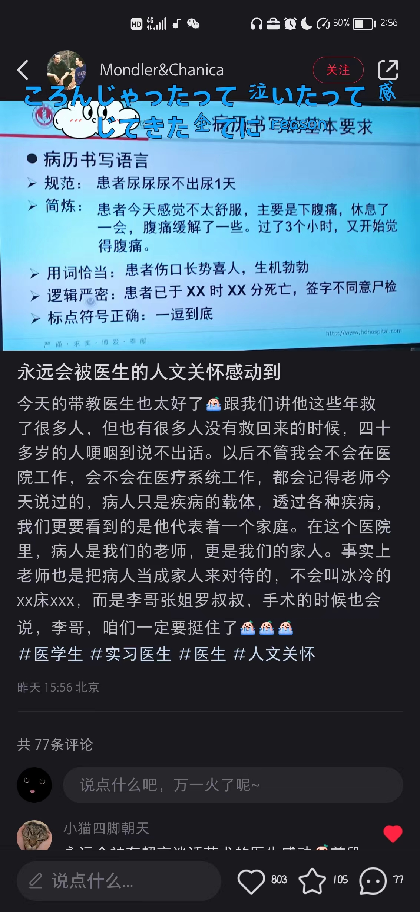
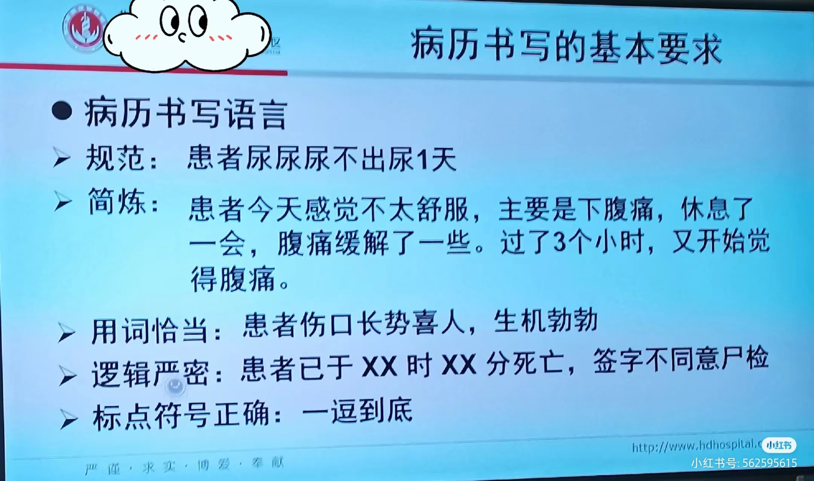

起因是我刷到这个帖子[^1]

看完就想起我们校医院的医生了。当时是很简单的小事：眼睛里进沙子了，挂了号，接待我的是两个白大褂，大概是一位医生带一个实习生的样子。当时我就听到其中一个白大褂问另一人：“那像这种情况，我们应该怎么处理”，医生就说“像这种情况我们就简单处理，如果解决不了就转出去，毕竟我们这里不是专门的眼科医院，没有那么专业的设备”，一听就是只能处理最简单的情况了。不过我的实际情况也不怎么严重，只是单纯眼睛里进了沙子自己弄不出来，我自己也是不怎么担心。

在诊室坐好后，医生首先问清楚是哪只眼睛、上边还是下边，然后熟练地翻开眼睑，用棉签在眼睑内侧从左到右擦过一遍。擦的时候，我的眼睑实在是刺痛，同时心里也担心直接用棉签刮擦眼睑内侧会不会有什么损伤，毕竟疼痛是身体的警告信号。估计是我的痛体现在表情上了，医生就安慰我说：“可能有点疼”。听到医生这句话，我就放心许多，因为让我担心的并不是疼，而是疼而医生没有提前告诉你这可能是疼的；医生告诉我可能有些疼，那我就能忍，因为我知道这一切都在医生的掌控中。

但是这还没完。擦过，眨一眨眼睛，待疼痛隐隐退去，就能明显感觉到我的眼睑自由了。医生问我：“怎么样，好了没？”我说我没事了，他就一边在工作台边摘下一次性手套，一边头也不回地补充一句：“嗯。刚才看到一个白色的东西擦出去了。”就在这时，我的脑海里立刻浮现出了在光滑的眼睑内侧粘贴的一个白色小方块，被一个用生理盐水浸润的无菌棉签干净利落地一把拂去的画面。尽管我实际上并没有见到、以前也不曾见过、以后也大概率是没有机会见到这样的画面，但是它就这么适时地出现在了我的脑海。

当时甚至我自己都被这个脑补出来的这个画面惊讶到了，没想到医生随口说的一句话就能有这么大的效果。我没有见到这个画面，我想他也不一定真的实际看到了我的眼睑里面那个他所说的“白色的东西”；我记得很清楚，他是通过询问确认异物感的位置而不是通过观察判断异物的位置，擦的时候是也用的棉签的整个棉头部分，从最左侧到最右侧很仔细地缓缓擦过去的，如果真的翻开眼睑就能看到这么明显的异物存在，那么大抵是用不到这么全面、这么仔细的擦法。但是，他对我说了，他用很确定的口吻告诉了我他“看到一个白色的东西擦出去了”，并且效果很显著，我在听到这句话的同时心里就很确信眼睛里的沙子已经不见了。我想，医者不仅医病，而且医心；他不仅擦去了我眼睛里的沙子，还拂去了我心里的那粒沙子。

一瞬间，医生站在工作台旁的身影就伟大了起来，哪怕只有一点点，但我确实感受到了从他身上散发出来的安心感。我又在想，刚才他在告诉我“可能有些疼”，他都是看到了我的表情才想起来说的，然而现在告诉我他“擦去了一个白色的东西”，确实不假思索的，头也不回地就说了，想必是已经在无数的看诊行医中养成了习惯，内化于心而外化于行。我还在想，这么年轻的一位医生，在大学校医院工作，每天要见多少患者，又要涉及到多少种类的千奇百怪的症状，难道对每个患者都这么有心吗？我如果是一名医生，大好的青春年华却只能谋求一个大学校医院的工作，心里大概多多少少是会有些不平衡的。但是他却让我看到了，哪怕是一位普通的大学校医，也不仅尽职尽责，而且还传递着人文关怀。

我不知道用词是否准确，但是这或许就是医者仁心吧。

[^1]: 89 Mondler&Chanica发布了一篇小红书笔记，快来看吧！ 😆 8HRoop0POlFsBFq 😆 http://xhslink.com/ulThrq，复制本条信息，打开【小红书】App查看精彩内容！
